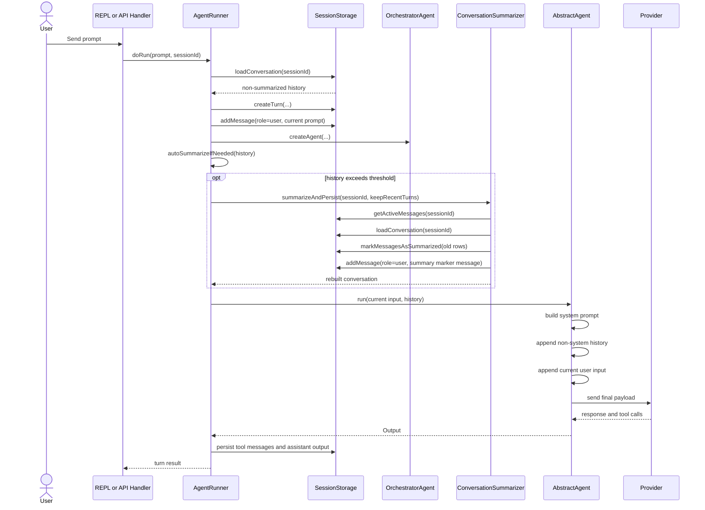
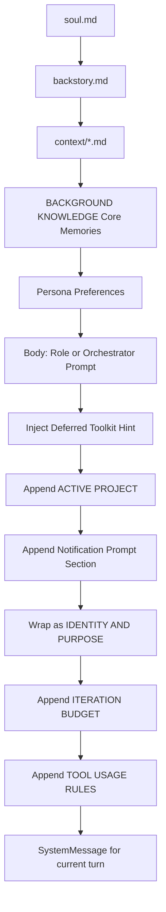
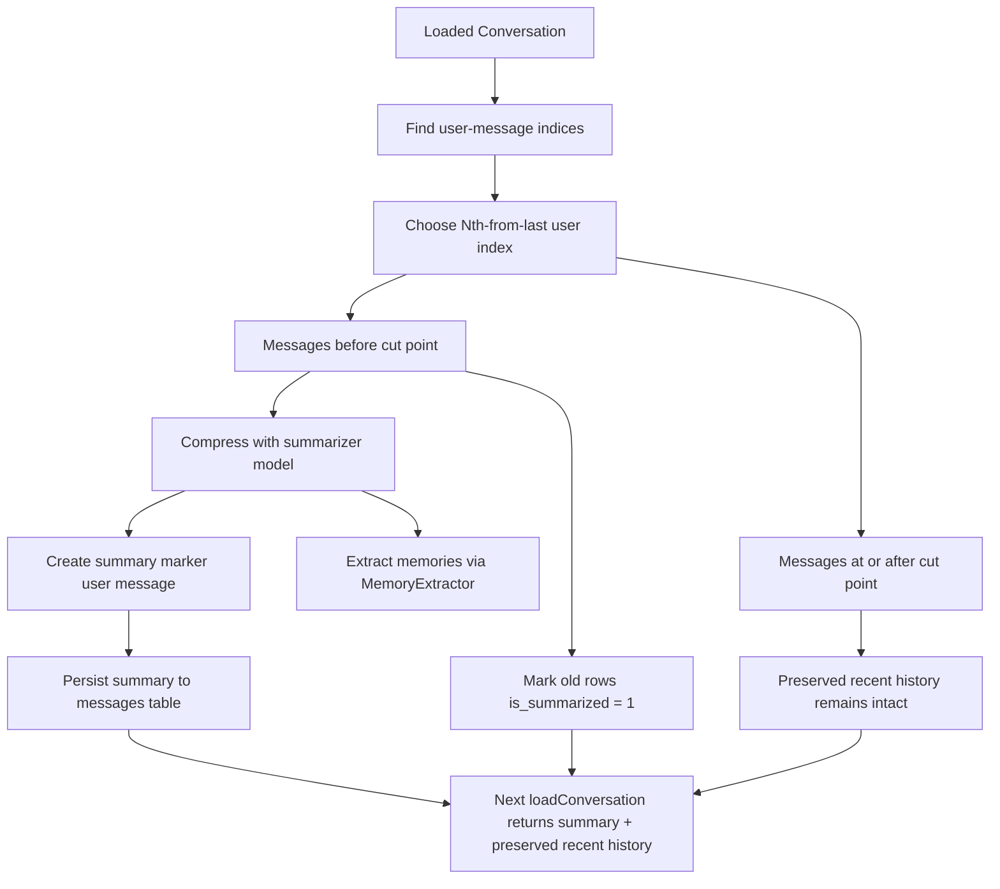
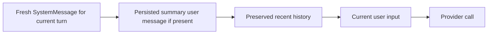
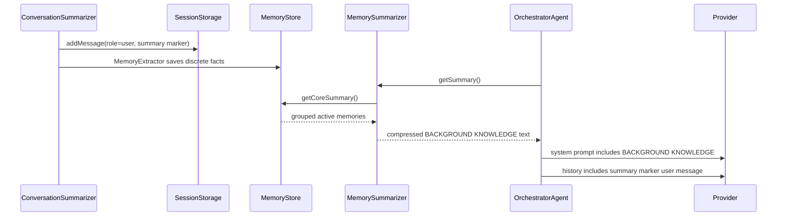

# Chat Flow

This document explains how Coqui assembles chat context for a single turn, how conversation summaries are created and re-injected, and how that differs between the REPL and API execution paths.

It focuses on five distinct context channels:

1. The system prompt assembled for the current turn.
2. Persisted conversation history loaded from storage.
3. Conversation summaries persisted back into history.
4. Persistent memory injected into the system prompt.
5. The current user input for the new turn.

The goal is to make the ordering explicit so it is clear when summaries enhance context and when they can compete with recent conversation.

## Core Rule

For a normal turn, the provider sees context in this order:

1. A fresh system prompt for the current turn.
2. Loaded non-system conversation history.
3. Any persisted conversation summary message that is part of that history.
4. The preserved recent messages that were kept after summarization.
5. The current user message for the new turn.

This means the summary is injected before the preserved recent conversation, and the current user message is still the last message in the provider payload.

## Main Components

| Component | Responsibility |
| --- | --- |
| `AgentRunner` | Loads history, decides whether to summarize, builds the agent, and runs the turn. |
| `OrchestratorAgent` | Builds the current system prompt, including memory, project, toolkit, and notification context. |
| `SessionStorage` | Persists messages and turns, reloads conversation history, and hides summarized rows from future loads. |
| `ConversationSummarizer` | Replaces older history with a summary while preserving recent user turns and their associated replies. |
| `MemoryStore` | Stores long-lived memories, including facts `MemoryExtractor` captures during summarization. |
| `MemorySummarizer` | Compresses stored memories into `## BACKGROUND KNOWLEDGE (Core Memories)` for system-prompt injection. |
| `AbstractAgent` | Builds the final provider payload: system prompt, history, then current input. |

## End-to-End Turn Flow

The normal turn path starts in `AgentRunner::doRun()` and ends in `AbstractAgent::run()`.


```mermaid
sequenceDiagram
    actor User
    participant Entry as REPL or API Handler
    participant Runner as AgentRunner
    participant Store as SessionStorage
    participant Agent as OrchestratorAgent
    participant Summ as ConversationSummarizer
    participant Core as AbstractAgent
    participant LLM as Provider

    User->>Entry: Send prompt
    Entry->>Runner: doRun(prompt, sessionId)
    Runner->>Store: loadConversation(sessionId)
    Store-->>Runner: non-summarized history
    Runner->>Store: createTurn(...)
    Runner->>Store: addMessage(role=user, current prompt)
    Runner->>Agent: createAgent(...)
    Runner->>Runner: autoSummarizeIfNeeded(history)
    opt history exceeds threshold
        Runner->>Summ: summarizeAndPersist(sessionId, keepRecentTurns)
        Summ->>Store: getActiveMessages(sessionId)
        Summ->>Store: loadConversation(sessionId)
        Summ->>Store: markMessagesAsSummarized(old rows)
        Summ->>Store: addMessage(role=user, summary marker message)
        Summ-->>Runner: rebuilt conversation
    end
    Runner->>Core: run(current input, history)
    Core->>Core: build system prompt
    Core->>Core: append non-system history
    Core->>Core: append current user input
    Core->>LLM: send final payload
    LLM-->>Core: response and tool calls
    Core-->>Runner: Output
    Runner->>Store: persist tool messages and assistant output
    Runner-->>Entry: turn result
```

## System Prompt Assembly

The system prompt is rebuilt for each turn by `OrchestratorAgent::instructions()` and then wrapped by `OrchestratorAgent::getSystemPromptText()`.

### Prompt assembly order

`OrchestratorAgent::instructions()` builds the base instruction text in this order:

1. Persona `soul.md` (identity — first for primacy attention).
2. Persona `backstory.md`.
3. Persona `context/*.md`.
4. `## BACKGROUND KNOWLEDGE (Core Memories)`.
5. Persona preferences (`## Preferences`).
6. The body — the role prompt or orchestrator prompt, carrying operational instructions, tools, security, and done rules.

Those parts are joined, and three injections then run over the joined text in order:

7. Deferred toolkit hints.
8. Active project context.
9. Notification prompt section at render time when present.

`OrchestratorAgent::getSystemPromptText()` then wraps those instructions with `SystemPrompt` in this order:

1. `# IDENTITY AND PURPOSE`
2. `# ITERATION BUDGET` when the role has a finite iteration cap
3. `# TOOL USAGE RULES`

Unlike tool schemas, toolkit guidelines are embedded in the system prompt text. Tool schemas are sent separately through the provider tool payload.


```mermaid
flowchart TD
    A[soul.md] --> B[backstory.md]
    B --> B2[context/*.md]
    B2 --> C[BACKGROUND KNOWLEDGE Core Memories]
    C --> C2[Persona Preferences]
    C2 --> A2[Body: Role or Orchestrator Prompt]
    A2 --> D[Inject Deferred Toolkit Hint]
    D --> E[Append ACTIVE PROJECT]
    E --> F[Append Notification Prompt Section]
    F --> G[Wrap as IDENTITY AND PURPOSE]
    G --> H[Append ITERATION BUDGET]
    H --> I[Append TOOL USAGE RULES]
    I --> J[SystemMessage for current turn]
```

## History Loading

`SessionStorage::loadConversation()` reconstructs the conversation from persisted messages ordered by `created_at`.

Important rules:

1. Only rows with `is_summarized = 0` are loaded.
2. Persisted `system` messages can still exist in storage, but `AbstractAgent::run()` skips system messages from loaded history when building the provider payload.
3. Persisted summary messages are stored as `user` messages, not `system` messages, so they survive history injection.
4. The current user prompt is stored before the turn runs, but the in-memory payload still appends the current prompt explicitly as the final input message.

That produces a clean separation between the fresh system prompt for the current turn and the stored conversational history from prior turns.

## How Summarization Works

`ConversationSummarizer::summarizeAndPersist()` is the main path used by `AgentRunner::autoSummarizeIfNeeded()`.

### Trigger

Auto-summarization can fire before the turn. `agents.defaults.context.autoSummarizeMode` selects **exactly one** trigger — the modes are mutually exclusive, not racing:

1. `token` (default) — estimated token usage reaches `agents.defaults.context.autoSummarizeThreshold`.
2. `turn` — user-turn count reaches `agents.defaults.context.autoSummarizeTurnThreshold`.
3. `manual` — pre-turn auto-summarization is disabled entirely, leaving only the in-loop fallback below.

`agents.defaults.context.autoSummarizeKeepRecent` controls how many recent user turns are preserved (clamped to 1–20).

There is also an in-loop fallback through `SummarizePruningStrategy` if the conversation still exceeds budget during the agent loop.

This is separate from the budget-exit threshold. Auto-summarization decides whether to compress history before or during the turn; budget exit decides whether the current iteration is close enough to the context window that the agent should wrap up. The budget-exit check uses the latest provider-reported usage for the current iteration, not a cumulative session-total counter, and it coexists with the normal `maxIterations` limit.

### Split behavior

The summarizer does not keep the last N raw messages. It keeps the last N user turns.

`splitConversation()` works like this:

1. Find all indices where the message role is `user`.
2. Pick the Nth-from-last user index as the cut point.
3. Summarize everything before that cut point.
4. Preserve everything from that cut point onward.

This means recent replies and tool results are preserved only if they occur at or after the preserved user-turn boundary.

### Persisted summary behavior

After summarization:

1. Old rows before the cut point are marked `is_summarized = 1`.
2. A new summary message is persisted as a `user` message.
3. The summary marker tells the model to treat the summary as background context and focus on the most recent messages below it.
4. Before compressing, `MemoryExtractor` captures discrete facts from the messages being summarized into the user-facing memory areas. The summary prose itself is not saved as a memory.


```mermaid
flowchart TD
    A[Loaded Conversation] --> B[Find user-message indices]
    B --> C[Choose Nth-from-last user index]
    C --> D[Messages before cut point]
    C --> E[Messages at or after cut point]
    D --> F[Compress with summarizer model]
    F --> G[Create summary marker user message]
    G --> H[Persist summary to messages table]
    D --> I[Mark old rows is_summarized = 1]
    F --> J[Extract memories via MemoryExtractor]
    E --> K[Preserved recent history remains intact]
    H --> L[Next loadConversation returns summary + preserved recent history]
    I --> L
    K --> L
```

## Provider Payload Order

`AbstractAgent::run()` constructs the final provider conversation in a strict order:

1. Add a fresh `SystemMessage` containing the current turn's system prompt.
2. Inject loaded history, skipping any history messages whose role is `system`.
3. Append the current input message.

That final sequence matters more than database order because it is the exact payload sent to the model.


```mermaid
flowchart LR
    A[Fresh SystemMessage for current turn] --> B[Persisted summary user message if present]
    B --> C[Preserved recent history]
    C --> D[Current user input]
    D --> E[Provider call]
```

### Practical implication

This already satisfies the primary history-ordering requirement:

1. The summary appears before the preserved recent messages.
2. The most recent conversation remains available after the summary.

## Memory Interaction

Summaries affect the model through two separate channels.

### Channel 1: Conversation history

The persisted summary is inserted into message history as a `user` message. On the next turn it appears before the preserved recent messages.

### Channel 2: Persistent memory

The summary text itself is **not** saved as a memory. Instead, immediately before compressing, `MemoryExtractor` runs over the messages about to be summarized — the last chance to capture noteworthy facts — and saves discrete memories into the user-facing areas (`identity`, `preferences`, `facts`, `context`, …).

`MemoryStore::getCoreSummary()` then feeds active memories to `MemorySummarizer::getSummary()`, which compresses them into the `## BACKGROUND KNOWLEDGE (Core Memories)` block. `getCoreSummary()` excludes archived rows, expired rows, `memory_type = 'task'`, and the legacy `session_summary` area, and is capped by an entry limit.

A legacy `session_summary` area exists in the schema but is dormant: nothing writes it, `getCoreSummary()` explicitly filters it out, and `BootManager` deletes the area on every boot. So extracted *facts* can resurface in the system prompt, but the summary prose cannot.


```mermaid
sequenceDiagram
    participant Summ as ConversationSummarizer
    participant Store as SessionStorage
    participant Mem as MemoryStore
    participant MemSum as MemorySummarizer
    participant Agent as OrchestratorAgent
    participant LLM as Provider

    Summ->>Store: addMessage(role=user, summary marker)
    Summ->>Mem: MemoryExtractor saves discrete facts
    Agent->>MemSum: getSummary()
    MemSum->>Mem: getCoreSummary()
    Mem-->>MemSum: grouped active memories
    MemSum-->>Agent: compressed BACKGROUND KNOWLEDGE text
    Agent->>LLM: system prompt includes BACKGROUND KNOWLEDGE
    Agent->>LLM: history includes summary marker user message
```

## Why Focus Can Still Drift

Even though the ordering is correct, the model can still appear to drift toward older work for a few reasons.

### 1. Facts extracted from summarized messages can echo the summary

The summary prose reaches the model exactly once, via history. But `MemoryExtractor` runs over the same messages just before they are compressed, so facts drawn from that stretch of conversation can also surface in the `## BACKGROUND KNOWLEDGE (Core Memories)` block.

### 2. Memory is injected before the body and before history

The `## BACKGROUND KNOWLEDGE (Core Memories)` block sits between the identity sections and the operational body, ahead of any history. This gives persistent memory a prominent position in the current turn.

### 3. Recent preservation is based on user-turn count

The summarizer preserves the last N user turns, not necessarily the last N detailed tool or assistant messages. If a lot happened just before the cut point, some detail can move into the summary sooner than expected.

### 4. Tool-heavy history is compressed

Very long individual messages are truncated before summarization. The summary is intended to preserve outcomes and next steps, not full tool output fidelity.

## REPL and API Differences

The core chat assembly path is the same in both modes. The differences are mostly at the entry and observation layers.

| Concern | REPL | API |
| --- | --- | --- |
| Turn execution | Synchronous in the REPL process | Started by the API server and streamed through SSE |
| Observer | `EscCancellationObserver` in the REPL (the one-shot `coqui run` CLI uses `TerminalObserver`) | Turns run in a child process observed by `TurnProcessObserver`, which persists events that the SSE endpoints poll and re-emit via `SseStream` |
| Chat-context assembly | Same `AgentRunner` and `AbstractAgent` flow | Same `AgentRunner` and `AbstractAgent` flow |
| Background execution | REPL can create tasks but does not execute them | API server executes tasks, loops, and schedules |

For standard prompt turns, the ordering of system prompt, history, summary, preserved recent messages, and current input is the same in both modes.

## Background Tasks and Loops

Background tasks and loop stages use the same summarization and prompt-building primitives when they run a turn, but they differ operationally:

1. Background tasks execute in separate processes managed by the API server.
2. Loop stages run as separate background task sessions.
3. Each stage gets its own execution session, but loop work can still share artifacts and project context through the work-scope session model.

Those differences change where chat context is sourced from, but they do not change the internal ordering inside a single turn once `AgentRunner` starts running.

## Verified Guarantees

The current implementation already guarantees the following:

1. The summary is inserted before the preserved recent messages in history.
2. The preserved recent messages remain available after summarization.
3. The current user input is appended after both the summary and the preserved recent history.
4. Old summarized rows are hidden from future history loads by `is_summarized = 1`.

## Known Attention Risks

The following are not ordering bugs, but they can still affect perceived focus:

1. Facts extracted from messages just before they are summarized can echo summary content in `## BACKGROUND KNOWLEDGE (Core Memories)`.
2. Core memory injection happens before the body and before history, so memory can be more salient than expected.
3. Preserved recency is measured by user messages, not by total conversational detail.
4. Summaries intentionally compress detail, especially large tool outputs.

## Reading the Next Turn After a Summary

After a summary is created, the next turn effectively looks like this:

```text
System prompt for current turn
  - role instructions
  - core memories
  - key context reminder
  - project context
  - notification context

Loaded non-system history
  - conversation summary user message
  - preserved recent messages

Current turn input
  - latest user message
```

That is the actual model-facing shape to keep in mind when diagnosing post-summary focus loss.
