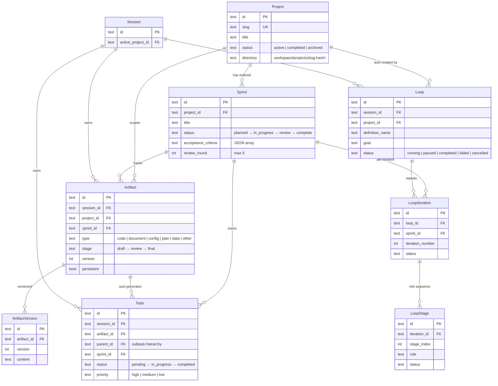

# Data Flow

How Projects, Sprints, Artifacts, Todos, and Loops work together to manage complex workflows in Coqui.



## Component Overview

| Component | Purpose | Scope | Storage |
| --- | --- | --- | --- |
| [Projects](/features/projects) | Organize work across sessions | Persistent | `projects` table |
| [Sprints](https://github.com/AgentCoqui/coqui/blob/main/docs/PROJECTS.md#sprints) | Ordered work units within a project | Persistent | `sprints` table |
| [Artifacts](/features/artifacts) | Versioned structured outputs (plans, docs, code) | Session or persistent | `artifacts` + `artifact_versions` tables |
| [Todos](/features/todos) | Task tracking and progress management | Session-scoped | `todos` table |
| [Loops](/features/loops) | Automated multi-role iteration cycles | Session-linked | `loops` + `loop_iterations` + `loop_stages` tables |

All tables reside in a shared SQLite database (WAL mode) managed by `SessionStorage`.

## Data Relationships

```
Project
├── Sprint 1 (planned → in_progress → review → complete)
│   ├── Artifact: plan (draft → review → final)
│   │   └── Todos: auto-generated from plan
│   │       ├── Todo 1 (pending → in_progress → completed)
│   │       ├── Todo 2
│   │       └── Todo 3
│   └── Artifact: loop_output (from loop stage)
├── Sprint 2
│   └── ...
└── Loop (harness: plan → coder → reviewer)
    ├── Iteration 1
    │   ├── Stage: plan
    │   ├── Stage: coder
    │   └── Stage: reviewer → "NEEDS CHANGES"
    └── Iteration 2
        ├── Stage: plan
        ├── Stage: coder
        └── Stage: reviewer → "APPROVED" (loop completes)
```

### Foreign Key Map

| From | Column | To | Cascade |
| --- | --- | --- | --- |
| `sprints` | `project_id` | `projects.id` | CASCADE delete |
| `artifacts` | `session_id` | `sessions.id` | — |
| `artifacts` | `project_id` | `projects.id` | — |
| `artifacts` | `sprint_id` | `sprints.id` | — |
| `todos` | `session_id` | `sessions.id` | CASCADE delete |
| `todos` | `artifact_id` | `artifacts.id` | SET NULL on delete |
| `todos` | `parent_id` | `todos.id` | CASCADE delete |
| `todos` | `sprint_id` | `sprints.id` | — |
| `loops` | `session_id` | `sessions.id` | — |
| `loop_iterations` | `loop_id` | `loops.id` | CASCADE delete |
| `loop_iterations` | `sprint_id` | `sprints.id` | — |
| `loop_stages` | `iteration_id` | `loop_iterations.id` | CASCADE delete |

## Common Workflow Patterns

### 1. Plan-Implement-Review (Manual)

The most common pattern for structured development:

```
User → /role plan → "Build a caching layer"
                ↓
    Plan agent: artifact_create(type: "plan")
                ↓ discovery, design, iteration
    Plan agent: artifact_stage("review")
                ↓ user approves
    Plan agent: artifact_stage("final")
                ↓ PlanTodoGenerator auto-creates todos
User → /role coder
                ↓
    Coder agent: todo_list() → reads plan todos
    Coder agent: implements each step, marks todo_complete()
                ↓
User → /role reviewer (or spawn_agent)
                ↓
    Reviewer: reads artifacts, checks todos, provides feedback
```

### 2. Automated Harness Loop

Fully automated plan-implement-review cycles:

```
Agent: loop_start(definition: "harness", goal: "Build caching layer")
                ↓
    Iteration 1:
        plan agent → creates implementation plan
        coder agent → implements the plan
        reviewer agent → evaluates, responds "NEEDS CHANGES"
                ↓ (termination not met, continue)
    Iteration 2:
        plan agent → reviews feedback, adjusts plan
        coder agent → makes revisions
        reviewer agent → responds "APPROVED"
                ↓ (termination met, loop completes)
```

### 3. Project-Scoped Sprint Workflow

For large features spanning multiple sessions:

```
Plan agent: project_create(title: "Auth System", slug: "auth")
Plan agent: sprint_create(project_id, title: "MVP Login")
Plan agent: artifact_create(type: "plan", project_id, sprint_id)
                ↓ iterates on plan
Plan agent: artifact_stage("final") → auto-generates todos
                ↓
Coder agent: reads todos, implements, marks complete
Coder agent: sprint_transition(id, "review")
                ↓
Reviewer agent: checks acceptance criteria
    If pass → sprint_transition(id, "complete")
    If fail → sprint_transition(id, "rejected", notes: "...")
                ↓ (back to coder on rejection)
```

## Session Propagation

All components share data through **session ID propagation**. When one agent spawns another, the parent's session ID flows to the child so all agents in a workflow see the same artifacts, todos, and sprint context.

| Spawn Method | Session Propagation |
| --- | --- |
| `spawn_agent` | Parent's `sessionId` → child's `ArtifactToolkit`, `TodoToolkit`, `SprintToolkit` |
| `loop_start` | Orchestrator's `sessionId` → `loops.session_id` → `LoopStageResult.sessionId` → stage agent toolkits |
| `start_background_task` | Parent's session → new child task session (separate session, but can read parent artifacts) |
| `/role switch` | Same session throughout |

## Active Project Context

When a project is active (set via `/projects ‹slug›` or `project_switch`), its metadata and sprint roster are injected into the system prompt. This gives all agents ambient awareness of the current project without explicit tool calls.

See [PROJECTS.md](https://github.com/AgentCoqui/coqui/blob/main/docs/PROJECTS.md#active-project-context) for details.

## Cleanup Lifecycle

| Component | Cleanup Trigger | Behavior |
| --- | --- | --- |
| Session-scoped artifacts | Session deletion | Deleted with session (non-persistent only) |
| Persistent artifacts | Manual deletion | Survive session deletion when `project_id` is set |
| Todos | Session deletion | CASCADE delete; also cleaned on boot for orphaned/stale entries |
| Sprints | Project deletion | CASCADE delete |
| Loops | Manual or loop completion | Loop records persist; stages cascade with iterations |

## Further Reading

- [PROJECTS.md](/features/projects) — Projects and sprints: creation, lifecycle, and review workflow
- [ARTIFACTS.md](/features/artifacts) — Versioned artifacts: staging, persistence, and plan handoff
- [TODOS.md](/features/todos) — Task tracking: auto-generation, bulk operations, and progress
- [LOOPS.md](/features/loops) — Automated workflows: definitions, termination, and session context
- [AGENTS.md](https://github.com/AgentCoqui/coqui/blob/main/AGENTS.md) — Full architecture reference for all systems
