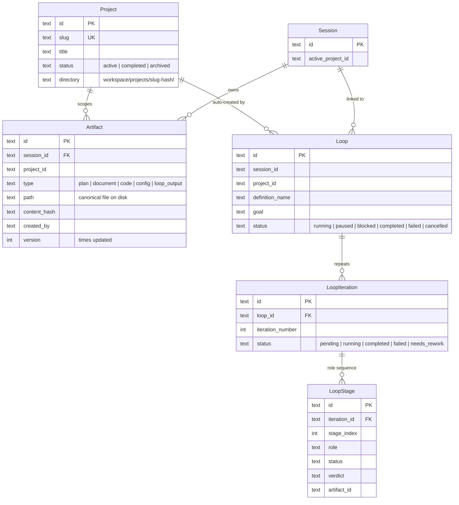

# Data Flow

How Projects, Artifacts, and Loops work together to manage complex workflows in Coqui.


```mermaid
erDiagram
    Project ||--o{ Artifact : "scopes"
    Project ||--o{ Loop : "auto-created by"
    Loop ||--o{ LoopIteration : "repeats"
    LoopIteration ||--o{ LoopStage : "role sequence"
    Session ||--o{ Artifact : "owns"
    Session ||--o{ Loop : "linked to"

    Project {
        text id PK
        text slug UK
        text title
        text status "active | completed | archived"
        text directory "workspace/projects/slug-hash/"
    }
    Artifact {
        text id PK
        text session_id FK
        text project_id
        text type "plan | document | code | config | loop_output"
        text path "canonical file on disk"
        text content_hash
        text created_by
        int version "times updated"
    }
    Loop {
        text id PK
        text session_id
        text project_id
        text definition_name
        text goal
        text status "running | paused | blocked | completed | failed | cancelled"
    }
    LoopIteration {
        text id PK
        text loop_id FK
        int iteration_number
        text status "pending | running | completed | failed | needs_rework"
    }
    LoopStage {
        text id PK
        text iteration_id FK
        int stage_index
        text role
        text status
        text verdict
        text artifact_id
    }
    Session {
        text id PK
        text active_project_id
    }
```

Only `PK`/`FK` markers reflect real constraints — see [Foreign Key Map](#foreign-key-map). An artifact's content is **not** in the database: the row is an index and `path` points at the file that holds it. See [ARTIFACTS.md](/features/artifacts).

## Component Overview

| Component | Purpose | Scope | Storage |
| --- | --- | --- | --- |
| [Projects](/features/projects) | Named working scope backed by a workspace directory | Persistent | `projects` table |
| [Artifacts](/features/artifacts) | Structured outputs (plans, docs, code) — every artifact's content is a file on disk; the DB row is a pure index | Session-owned; survives via a project link | `artifacts` table + files under `artifacts/‹type›/‹slug›-‹shortid›.‹ext›` |
| [Loops](/features/loops) | Automated multi-role iteration cycles | Session-linked | `loops` + `loop_iterations` + `loop_stages` tables |

All tables reside in a shared SQLite database (WAL mode) managed by `SessionStorage`.

## Data Relationships

```
Project (active | completed | archived)
│   working directory: workspace/projects/slug-hash/
├── Artifact: plan (file on disk, version counter bumped per update)
├── Artifact: loop_output (from loop stage)
└── Loop (harness: plan → coder → reviewer)
    ├── Iteration 1
    │   ├── Stage: plan
    │   ├── Stage: coder
    │   └── Stage: reviewer → "NEEDS CHANGES"
    └── Iteration 2
        ├── Stage: plan
        ├── Stage: coder
        └── Stage: reviewer → "APPROVED" (loop completes)
```

### Foreign Key Map

Foreign keys are enforced (`PRAGMA foreign_keys=ON`), so the distinction below is
load-bearing: only the first three links cascade. The rest are plain columns that
happen to hold an id — nothing at the database level keeps them honest.

**Real `FOREIGN KEY` constraints:**

| From | Column | To | On delete |
| --- | --- | --- | --- |
| `artifacts` | `session_id` | `sessions.id` | CASCADE |
| `loop_iterations` | `loop_id` | `loops.id` | CASCADE |
| `loop_stages` | `iteration_id` | `loop_iterations.id` | CASCADE |

**Logical links — no constraint, no cascade:**

| From | Column | Points at | Consequence |
| --- | --- | --- | --- |
| `artifacts` | `project_id` | `projects.id` | Deleting a project leaves its artifacts in place |
| `loops` | `session_id` | `sessions.id` | Nullable; not cleaned up with the session |
| `loops` | `project_id` | `projects.id` | Nullable; not cleaned up with the project |
| `sessions` | `active_project_id` | `projects.id` | Cleared explicitly on project delete — the guarantee is application-level, not a cascade |

## Common Workflow Patterns

### 1. Plan-Implement-Review (Manual)

The most common pattern for structured development:

```
User → /role plan → "Build a caching layer"
                ↓
    Plan agent: artifact_create(type: "plan")
                ↓ discovery, design, iteration
    Plan agent: artifact_update(id, content)   ← full rewrite, bumps version
                ↓ user approves in conversation
User → /role coder
                ↓
    Coder agent: artifact_get(id) → reads the plan
    Coder agent: implements each step
                ↓
User → /role reviewer (or spawn_agent)
                ↓
    Reviewer: reads artifacts, provides feedback
```

Approval is a conversation, not a database state: there is no stage machine and no
`artifact_stage` tool. `artifact_update` is a full rewrite that bumps a `version`
counter; per-version snapshots are not kept, since the file's history lives in the
user's own VCS.

### 2. Automated Harness Loop

Fully automated plan-implement-review cycles:

```
Agent: loop_start(definition: "harness", goal: "Build caching layer")
                ↓
    Iteration 1:
        plan agent → creates implementation plan
        coder agent → implements the plan
        reviewer agent → evaluates, responds "NEEDS CHANGES"
                ↓ (termination not met, continue)
    Iteration 2:
        plan agent → reviews feedback, adjusts plan
        coder agent → makes revisions
        reviewer agent → responds "APPROVED"
                ↓ (termination met, loop completes)
```

### 3. Project-Scoped Workflow

For work spanning multiple sessions, scope it to a project so artifacts persist and share a working directory:

```
Plan agent: project_create(title: "Auth System", slug: "auth")
                ↓ project becomes active, workspace dir created
Plan agent: artifact_create(type: "plan")
                ↓ inherits the active project's link — there is no project_id param
Plan agent: artifact_update(id, content)
                ↓
Coder agent: artifact_get(id) → reads the plan, implements
                ↓
Reviewer agent: reviews artifacts, provides feedback
                ↓ when work is done
project_update(id, status: "completed")
```

## Session Propagation

All components share data through **session ID propagation**. When one agent spawns another, the parent's session ID flows to the child so all agents in a workflow see the same artifacts and project context.

| Spawn Method | Session Propagation |
| --- | --- |
| `spawn_agent` | Parent's `sessionId` → child's `ArtifactToolkit`, `ProjectToolkit` |
| `loop_start` | Orchestrator's `sessionId` → `loops.session_id` → `LoopStageResult.sessionId` → stage agent toolkits |
| Background task (`POST /api/v1/tasks`, loops, schedules) | `parent_session_id` → new child task session (separate session, but can read parent artifacts) |
| `/role switch` | Same session throughout |

## Active Project Context

When a project is active (set via `/projects ‹slug›` or `project_switch`), its metadata and working directory are injected into the system prompt. This gives all agents ambient awareness of the current project without explicit tool calls.

See [PROJECTS.md](https://github.com/carmelosantana/coqui/blob/main/docs/PROJECTS.md#active-project-context) for details.

## Cleanup Lifecycle

Ownership decides cleanup: an artifact belongs to its session unless a project link
gives it a longer life.

| Component | Cleanup trigger | Behavior |
| --- | --- | --- |
| Session-only artifacts | Session deletion | Files removed, index rows cascade with the session |
| Project-linked artifacts | Never automatic | They **block** session deletion — `DELETE /sessions/{id}` returns `409 CONFLICT` rather than removing them |
| Loops | Manual or loop completion | Loop records persist (no FK on `loops.session_id`); iterations and stages cascade with the loop |
| Projects | Manual | Deleting a project leaves its artifacts and loops in place — neither link is a constraint |

See [ARTIFACTS.md](https://github.com/carmelosantana/coqui/blob/main/docs/ARTIFACTS.md#retention-ownership-based) for the retention rules
themselves; this table covers only how they play out across components.

## Further Reading

- [PROJECTS.md](/features/projects) — Projects as working scopes: creation and lifecycle
- [ARTIFACTS.md](/features/artifacts) — Artifacts as files: creation, retention, and plan handoff
- [LOOPS.md](/features/loops) — Automated workflows: definitions, termination, and session context
- [AGENTS.md](https://github.com/carmelosantana/coqui/blob/main/AGENTS.md) — Contributor guide: project model, coding boundaries, and workflow
